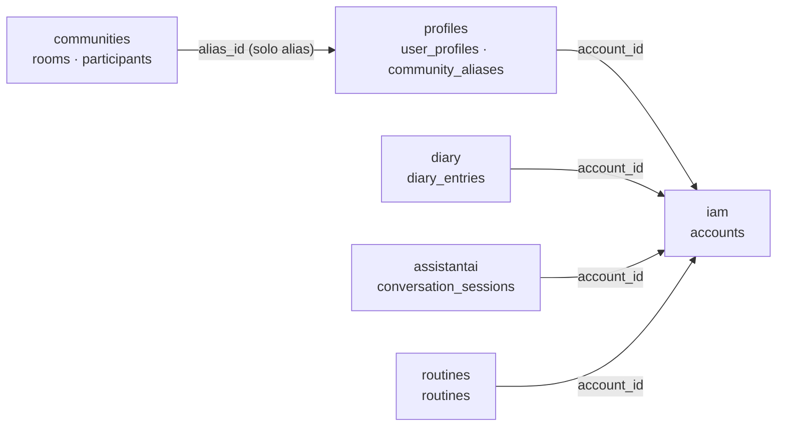
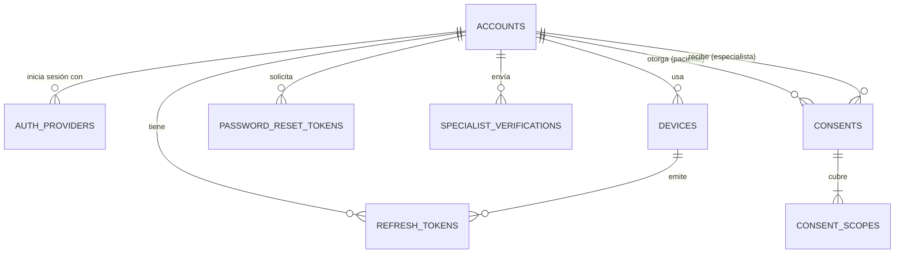
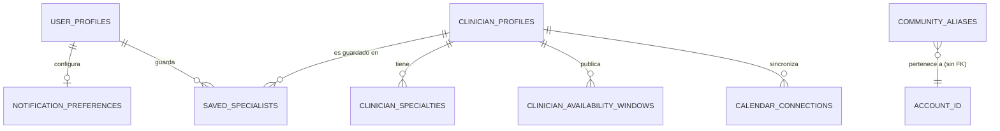
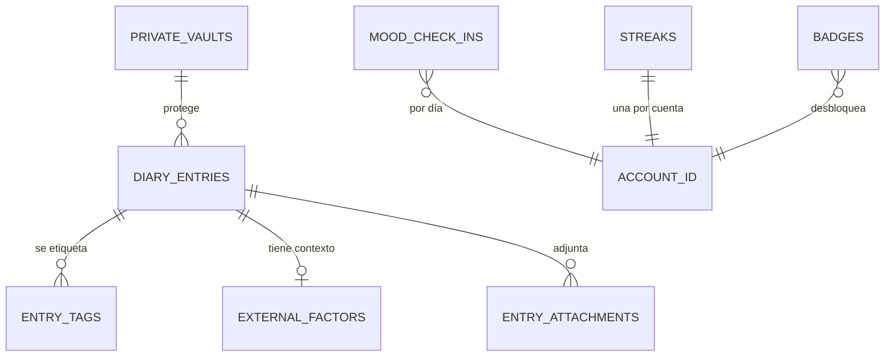
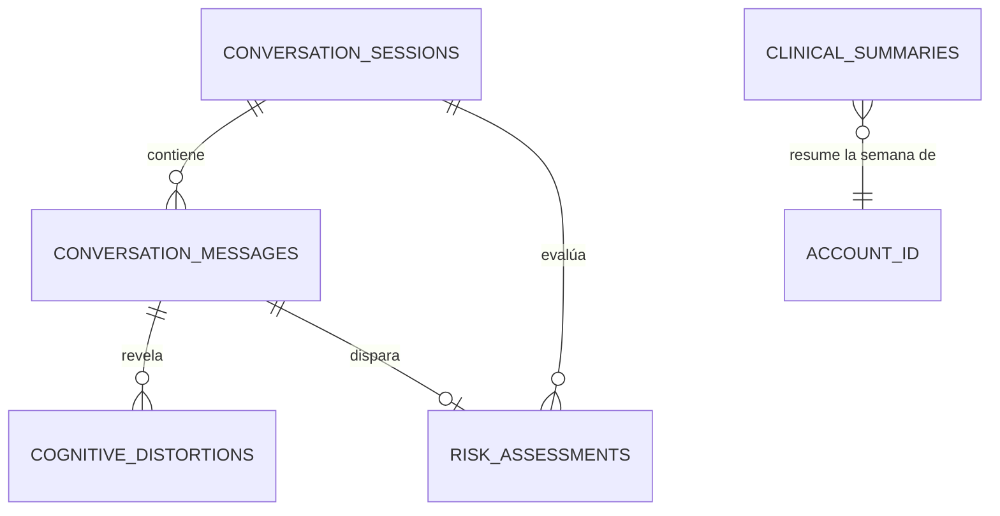
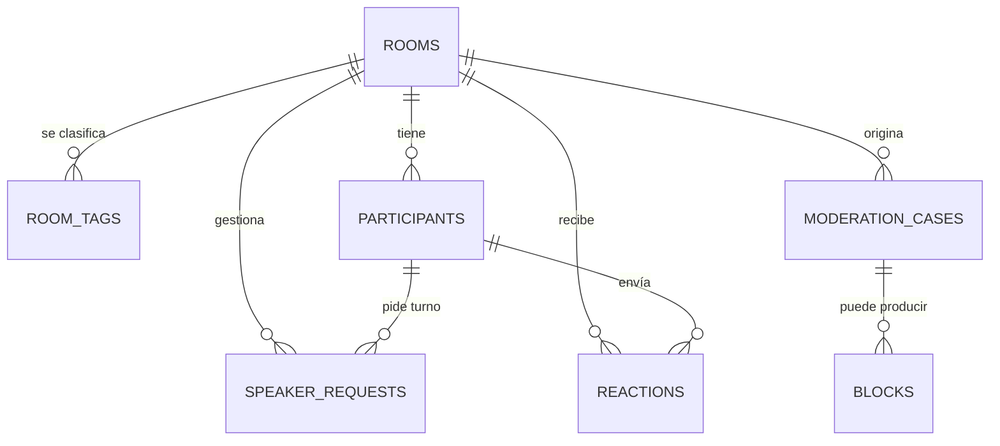
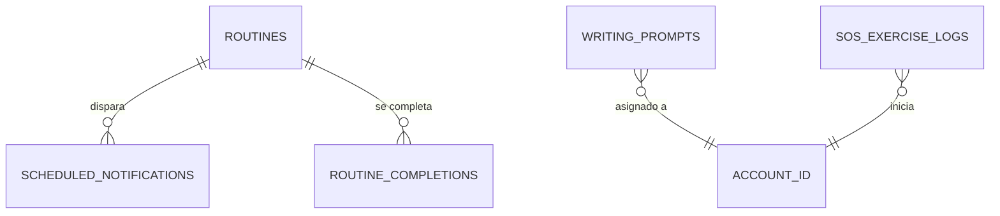

# Base de datos de MindCluster (SafeDiary)

Este es el diseño completo de la base de datos de SafeDiary y las reglas que todo el equipo sigue para cambiarla.

- **Fuente de verdad del modelo:** [`schema.sql`](schema.sql), un esquema PostgreSQL validado que carga sin errores.
- **Origen:** el Event Storming de Miro y el capítulo 2.6 del informe (diagramas de base de datos por bounded context), corregidos donde se contradecían. Las decisiones están abajo.
- **Motor:** PostgreSQL 16 o superior; en local usamos el 18. Hay una sola base, `safediary_db`, con **un esquema por bounded context**.

---

## 1. Mapa general

| Esquema | Bounded context | Dueño (llenar) | Tablas |
|---|---|---|---|
| `iam` | IAM | | `accounts`, `auth_providers`, `devices`, `refresh_tokens`, `password_reset_tokens`, `specialist_verifications`, `consents`, `consent_scopes`, `audit_events` |
| `profiles` | Profiles | | `user_profiles`, `notification_preferences`, `clinician_profiles`, `clinician_specialties`, `clinician_availability_windows`, `calendar_connections`, `saved_specialists`, `community_aliases` |
| `diary` | Diary | | `diary_entries`, `entry_tags`, `external_factors`, `entry_attachments`, `mood_check_ins`, `private_vaults`, `streaks`, `badges` |
| `assistantai` | AssistantAI | | `conversation_sessions`, `conversation_messages`, `cognitive_distortions`, `risk_assessments`, `clinical_summaries` |
| `communities` | Communities (absorbe Rooms) | | `rooms`, `room_tags`, `participants`, `speaker_requests`, `reactions`, `moderation_cases`, `blocks` |
| `routines` | Routines (DailyCare) | | `routines`, `scheduled_notifications`, `routine_completions`, `writing_prompts`, `sos_exercise_logs` |



Las flechas son **referencias por id, sin llave foránea**. Communities nunca apunta a `iam`: solo conoce alias.

---

## 2. Decisiones de diseño (y por qué)

1. **Un esquema PostgreSQL por bounded context.**
   - Cada equipo es dueño de su esquema, y se ve a simple vista qué tabla pertenece a qué contexto.
   - Si un contexto se separa en otro servicio, su esquema se lleva tal cual.
2. **Llaves foráneas solo dentro del mismo esquema.**
   - Entre contextos se guarda el id (`account_id`, `alias_id`) sin `REFERENCES`.
   - Es lo que pide DDD: un agregado referencia a otro de otro contexto **por identidad**, no por objeto.
   - Si IAM cambia, no rompe a Diary.
   - La consistencia entre contextos se logra con eventos (por ejemplo, "Cuenta de usuario registrada" → Profiles crea el perfil).
3. **`id BIGINT` autoincremental**, no `uuid` como en el informe, porque `AuditableAbstractAggregateRoot` del kernel `shared` ya usa `Long` + `IDENTITY` y AssistantAI ya está implementado así.
4. **Enums como `VARCHAR` + `CHECK`**, con los mismos valores que los `enum` de Java (`@Enumerated(EnumType.STRING)`). Si agregas un valor al enum, agregas una migración que cambie el `CHECK`.
5. **Fechas en `TIMESTAMPTZ`** (`Instant` en Java) y, en cada tabla, `created_at` / `updated_at`. Las tablas de log que no se editan, como `audit_events`, solo tienen `occurred_at`.
6. **Conflictos del informe y del tablero, resueltos:**

   | Conflicto | Decisión |
   |---|---|
   | Communities y Rooms modelan las mismas salas | **Un solo contexto, `communities`**. Rooms queda como el adaptador WebRTC, sin tablas propias. |
   | El alias comunitario aparece en Profiles y en Rooms | Vive **solo** en `profiles.community_aliases`, la única tabla que une alias con cuenta. `communities` solo guarda `alias_id`. Así se cumple la invariante "la identidad clínica nunca entra al modelo comunitario". |
   | La bóveda privada estaba en IAM | Pasa a **Diary** (`private_vaults` + `diary_entries.vault_id`), porque protege entradas del diario. |
   | Consentimiento en IAM o en Profiles | **IAM** (`consents` + `consent_scopes`), como dicen el informe y el flujo 3. Cada cambio se registra en `iam.audit_events`. |
   | La verificación de especialista estaba en Profiles | **IAM** (`specialist_verifications`), porque es un evento de IAM. Profiles solo guarda la ficha pública (`clinician_profiles`). |
   | El token push estaba en la tabla `USER` de Routines | **`iam.devices`**, porque es por dispositivo. Routines lo pide a IAM al enviar. |
   | `diary_reminders` en Diary duplicaba las rutinas | Un recordatorio de diario es una **rutina** con `routine_type = 'JOURNALING'`. |
   | El informe permite una sola evaluación de riesgo por sesión | **Una por mensaje evaluado** (`risk_assessments.message_id`), como funciona el código. |
   | Línea de crisis 988 (EE. UU.) | No se guarda en la base; el backend usa Línea 113 opción 5 y SAMU 106. |

7. **Privacidad (datos de salud mental):**
   - No se guarda audio crudo de las salas.
   - Los tokens se guardan como hash (`token_hash`) y los del calendario, cifrados por la aplicación (`refresh_token_encrypted`).
   - El especialista solo lee datos del paciente si existe un `iam.consents` con `status = 'GRANTED'` y el `consent_scopes` correspondiente.
   - El borrado de entradas es lógico (`status = 'DELETED'`).
8. **Reglas de negocio en la base** (validadas con datos de prueba):
   - un correo por cuenta, sin distinguir mayúsculas;
   - un solo consentimiento activo por paciente y especialista;
   - un alias activo por cuenta;
   - un alias dentro de una sala a la vez;
   - una solicitud de turno pendiente por participante;
   - un registro de ánimo por día;
   - una entrada de texto debe tener contenido y una de voz, audio.

---

## 3. Diagramas por contexto

Solo muestran las relaciones; las columnas completas están en [`schema.sql`](schema.sql).













---

## 4. Cómo trabajamos con la base (reglas del equipo)

### 4.1 Nombres

| Elemento | Regla | Ejemplo |
|---|---|---|
| Esquema | nombre del bounded context, minúsculas | `diary` |
| Tabla | `snake_case`, **plural** | `diary_entries` |
| Columna | `snake_case`, singular | `written_at` |
| PK | siempre `id` | `id BIGINT` |
| Referencia | `<entidad>_id` | `entry_id`, `account_id` |
| Booleanos | adjetivo o `is_`/`has_` | `active`, `is_sensitive` |
| Fechas | `_at` para instante, `_on` para fecha | `sent_at`, `logged_on` |
| Índice | `ix_<tabla>_<columnas>`; único: `ux_...` | `ix_rooms_lifecycle` |
| Check | `ck_<tabla>_<regla>` | `ck_consents_period` |

Los nombres de tabla y columna salen solos de la `SnakeCaseWithPluralizedTablePhysicalNamingStrategy` del kernel `shared`. En la entidad JPA basta con `@Table(schema = "diary")`; no pongas `name` salvo que el plural automático salga mal.

### 4.2 Las entidades JPA siguen al esquema, no al revés

- Cada contexto mapea **solo** las tablas de su esquema.
- No hay `@ManyToOne` hacia una entidad de otro contexto. Se guarda `private Long accountId;` y punto.
- Para leer datos de otro contexto se usa su **fachada de aplicación** (ACL), nunca su repositorio ni un `JOIN` entre esquemas.

### 4.3 Migraciones con Flyway (siguiente paso)

Hoy el backend usa `spring.jpa.hibernate.ddl-auto=update`. Sirve para empezar, pero con un equipo genera bases distintas en cada máquina y nunca borra ni corrige nada. El objetivo es:

- Agregar Flyway (`spring-boot-starter-flyway` + `flyway-database-postgresql`) y cambiar a `ddl-auto=validate`, para que Hibernate solo **compruebe** que las entidades coinciden con la base.
- Guardar las migraciones en `src/main/resources/db/migration/`, una por cambio, con este nombre:
  ```
  V<yyyyMMddHHmm>__<contexto>_<qué_cambia>.sql
  V202610041200__diary_create_diary_entries.sql
  V202610051530__routines_add_routine_type.sql
  ```
  La versión con fecha y hora evita que dos compañeros elijan el mismo `V5` en ramas paralelas.
- **Nunca editar una migración ya mergeada en `develop`.** Si algo quedó mal, se escribe una nueva que lo corrija. Flyway valida el checksum y la app no arranca si alguien cambió una vieja.
- Todo cambio de tabla actualiza también `schema.sql` y este README en el mismo PR, para que el modelo de referencia nunca quede desactualizado.

### 4.4 Flujo para un cambio de base de datos

1. Crea la rama del cambio desde `develop` (GitFlow), por ejemplo `feature/diary-voice-entries`.
2. Escribe la migración de **tu** esquema. Si necesitas algo de otro contexto, habla con su dueño: no se tocan esquemas ajenos.
3. Crea o actualiza la entidad JPA y su repositorio.
4. Actualiza `schema.sql` y la sección de este README si cambió una relación o una decisión.
5. Corre los tests y levanta la app contra tu PostgreSQL local para que Flyway y `validate` pasen.
6. Abre el PR a `develop`. El dueño del esquema (tabla de la sección 1) revisa con este checklist:
   - [ ] La migración es nueva y no edita otra ya mergeada.
   - [ ] No hay `REFERENCES` hacia otro esquema.
   - [ ] Los enums del `CHECK` coinciden con el `enum` de Java.
   - [ ] Las columnas obligatorias tienen `NOT NULL` y las búsquedas frecuentes, índice.
   - [ ] No hay datos sensibles en texto plano (tokens, PIN, contraseñas).
   - [ ] `schema.sql` y el README están actualizados.

### 4.5 Base local de cada integrante

- Todos usan `safediary_db` en PostgreSQL local, con usuario `postgres`.
- Las credenciales y keys van en `config/application.properties`, que está ignorado por git y nunca se sube.
- Para empezar de cero: borra y crea `safediary_db`; Flyway la reconstruye al arrancar.

---

## 5. Estado actual frente al diseño

| Contexto | Estado |
|---|---|
| AssistantAI | **Implementado**, todavía en el esquema `public`. Falta moverlo a `assistantai` y agregar `risk_assessments.message_id`. |
| IAM, Profiles, Diary, Communities, Routines | Solo diseño (este documento). Cada dueño crea sus tablas con migraciones siguiendo `schema.sql`. |
