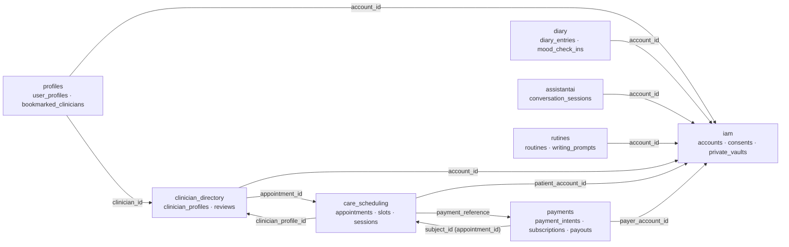
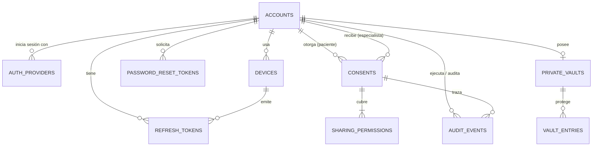
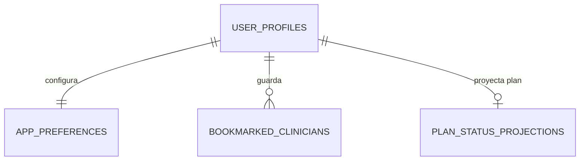
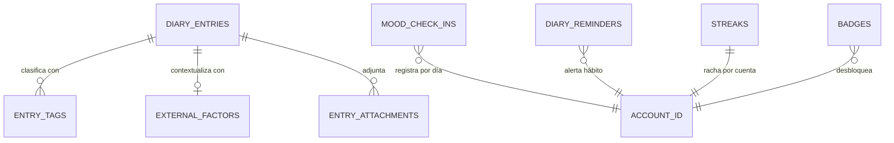
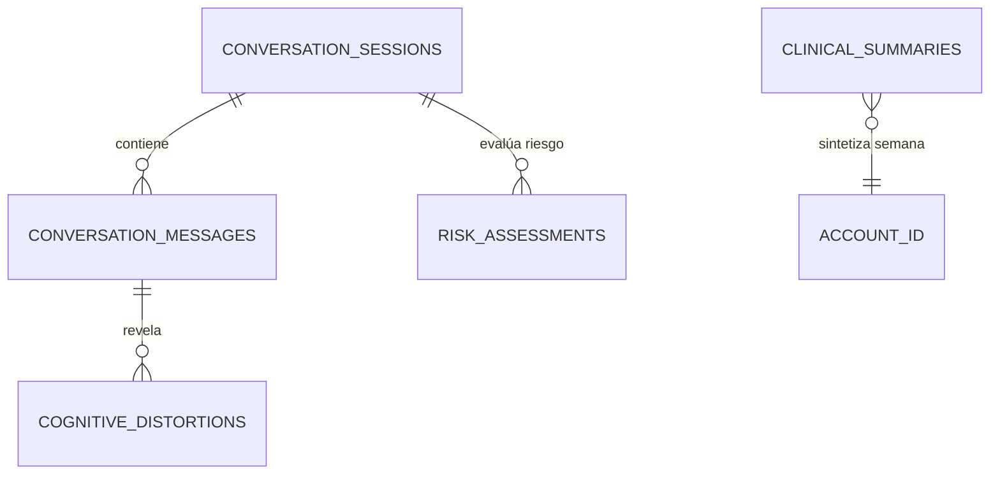
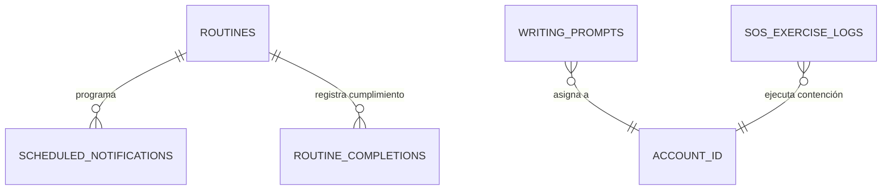
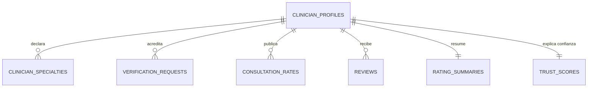
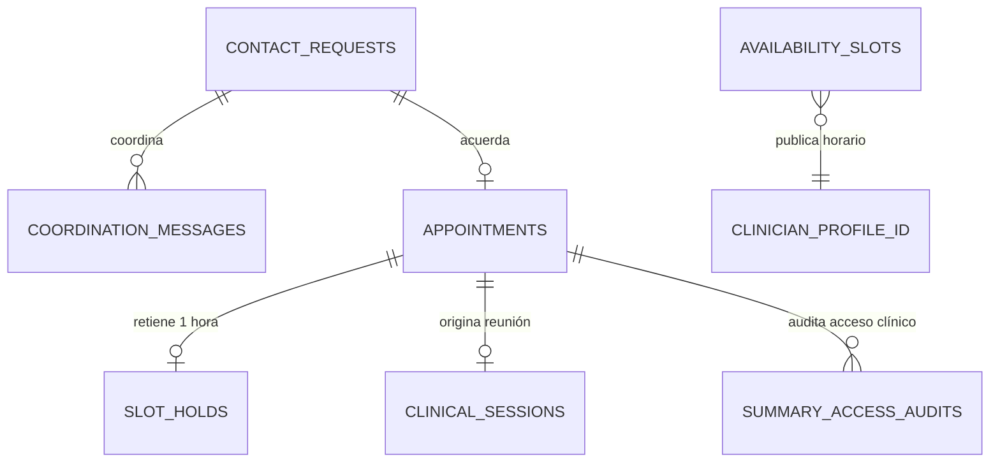
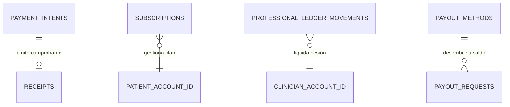

# Base de datos de MindCluster (SafeDiary)

Este es el diseño completo de la base de datos de SafeDiary y las reglas que todo el equipo sigue para cambiarla.

- **Fuente de verdad del modelo:** [`schema.sql`](schema.sql), un esquema PostgreSQL validado que carga sin errores.
- **Origen:** el Event Storming de Miro, el capítulo 2.5 (Strategic DDD) y el capítulo 2.6 del informe (diagramas de base de datos y capas de dominio por bounded context).
- **Motor:** PostgreSQL 14 o superior; en local usamos el 16/18. Hay una sola base, `safediary_db`, con **un esquema por bounded context**.

---

## 1. Mapa general

SafeDiary está estructurado en **8 bounded contexts**:

| Esquema | Bounded context | Dueño (llenar) | Tablas |
|---|---|---|---|
| `iam` | IAM | | `accounts`, `auth_providers`, `devices`, `refresh_tokens`, `password_reset_tokens`, `consents`, `sharing_permissions`, `private_vaults`, `vault_entries`, `audit_events` |
| `profiles` | Profiles | | `user_profiles`, `app_preferences`, `bookmarked_clinicians`, `plan_status_projections` |
| `diary` | Diary | | `diary_entries`, `entry_tags`, `external_factors`, `entry_attachments`, `mood_check_ins`, `diary_reminders`, `streaks`, `badges` |
| `assistantai` | AssistantAI | | `conversation_sessions`, `conversation_messages`, `cognitive_distortions`, `risk_assessments`, `clinical_summaries` |
| `rutines` | Rutines | | `routines`, `scheduled_notifications`, `routine_completions`, `writing_prompts`, `sos_exercise_logs` |
| `clinician_directory` | Clinician Directory | | `clinician_profiles`, `clinician_specialties`, `verification_requests`, `consultation_rates`, `reviews`, `rating_summaries`, `trust_scores` |
| `care_scheduling` | Care Scheduling | | `contact_requests`, `coordination_messages`, `availability_slots`, `appointments`, `slot_holds`, `clinical_sessions`, `summary_access_audits` |
| `payments` | Payments & Payouts | | `payment_intents`, `subscriptions`, `receipts`, `professional_ledger_movements`, `payout_methods`, `payout_requests` |

Las flechas son **referencias por id, sin llave foránea entre esquemas**.

---

## 2. Decisiones de diseño (y por qué)

1. **Un esquema PostgreSQL por bounded context.**
   - Cada equipo es dueño de su esquema, y se ve a simple vista qué tabla pertenece a qué contexto.
   - Si un contexto se separa en otro microservicio, su esquema se extrae tal cual sin dependencias de base de datos.
2. **Llaves foráneas solo dentro del mismo esquema.**
   - Entre contextos se guarda el id (`account_id`, `clinician_profile_id`, `appointment_id`...) sin `REFERENCES`.
   - Es lo que exige Domain-Driven Design: un agregado referencia a otro de otro contexto **por identidad**, no por objeto persistente.
   - Si IAM cambia internamente, no rompe a Diary ni a Care Scheduling.
   - La consistencia entre contextos se logra mediante eventos de dominio e integración (por ejemplo, `UserAccountRegistered` → Profiles crea el perfil).
3. **`id BIGINT` autoincremental (`IDENTITY`)**, coincidiendo con la arquitectura real del kernel `shared` (`AuditableAbstractPersistenceEntity` / `AuditableAbstractAggregateRoot` con `Long` + `IDENTITY`) y los modelos JPA implementados en `assistantai`.
4. **Enums como `VARCHAR` + `CHECK`**, con los mismos valores que los `enum` de Java (`@Enumerated(EnumType.STRING)`).
5. **Fechas en `TIMESTAMPTZ`** (`Instant` en Java) y, en cada tabla, `created_at` / `updated_at`. Las tablas inmutables de auditoría o eventos (`audit_events`) registran `occurred_at`.
6. **Fronteras y alineación con el informe (Capítulo 2):**

   | Decisión / Conflicto resuelto | Implementación en la base de datos |
   |---|---|
   | **Eliminación de Communities y Rooms** | Communities y Rooms ya no forman parte de los bounded contexts del sistema. Su esquema, tablas y llaves foráneas fueron removidos en su totalidad. |
   | **Clinician Directory como contexto propio** | Administra la ficha profesional pública (`clinician_profiles`), credenciales y documentos privados de verificación (`verification_requests`), especialidades (`clinician_specialties`), tarifas vigentes (`consultation_rates`), reseñas de citas completadas (`reviews`), promedio (`rating_summaries`) y puntaje de confianza (`trust_scores`). |
   | **Care Scheduling como contexto propio** | Administra la coordinación previa (`contact_requests`, `coordination_messages`), la disponibilidad reservable (`availability_slots`), las citas acordadas (`appointments`), los bloqueos temporales de 1 hora (`slot_holds`), la sesión de videollamada (`clinical_sessions`) y la auditoría de consulta autorizada del resumen emocional (`summary_access_audits`). |
   | **Payments & Payouts como contexto propio** | Procesa cobros de sesiones y planes Premium con clave idempotente (`payment_intents`), comprobantes oficiales (`receipts`), suscripciones Básico/Premium (`subscriptions`), liquidación de ingresos profesionales y comisión de plataforma (`professional_ledger_movements`), cuentas de retiro (`payout_methods`) y solicitudes de desembolso (`payout_requests`). |
   | **Bóveda privada en IAM y Diary** | IAM administra las credenciales de la bóveda (`private_vaults`) y las referencias a entradas protegidas (`vault_entries`). Diary marca sus entradas con el flag `is_vaulted` y solo autoriza su lectura mediante token emitido por IAM. |
   | **Consentimiento en IAM** | Administrado mediante `consents` y `sharing_permissions` (alcance temporal y granular de diario, estado anímico y resúmenes clínicos de IA). Toda consulta y revocación genera trazabilidad en `iam.audit_events`. |
   | **Sincronización con JPA de AssistantAI** | Las tablas coinciden exactamente con las entidades de producción: sesiones con `title`, mensajes con Plutchik tags, distorsiones cognitivas y evaluaciones de riesgo inmutables. `clinical_summaries` se incluye como tabla planificada alineada a su entidad JPA y al informe. |
   | **Nombre del esquema Rutines** | Nombrado `rutines` conforme a la especificación de dominio del informe y los bounded contexts aprobados. |

7. **Privacidad (datos de salud mental y seguridad financiera):**
   - No se guardan números completos de tarjetas bancarias ni audios de sesiones de videollamada.
   - Los tokens y credenciales de acceso se almacenan como hashes criptográficos (`password_hash`, `token_hash`, `pin_hash`).
   - El acceso del especialista a la información emocional requiere un `iam.consents` con `status = 'ACTIVE'` y un `sharing_permissions` coincidente.
   - El borrado de entradas del diario es lógico (`status = 'DELETED'`).
8. **Reglas de negocio e invariantes en la base:**
   - Un correo electrónico único por cuenta sin distinción de mayúsculas/minúsculas.
   - Un solo consentimiento activo por par paciente-especialista.
   - Un solo registro de estado de ánimo rápido por día por usuario (`mood_check_ins`).
   - Una sola reseña por cita completada en Clinician Directory.
   - Clave idempotente única para cobros en Payments.
   - Retención temporal de cita (`slot_holds`) expira a la hora de su creación.

---

## 3. Diagramas por contexto

### 3.1 IAM (`iam`)

### 3.2 Profiles (`profiles`)

### 3.3 Diary (`diary`)

### 3.4 AssistantAI (`assistantai`)

### 3.5 Rutines (`rutines`)

### 3.6 Clinician Directory (`clinician_directory`)

### 3.7 Care Scheduling (`care_scheduling`)

### 3.8 Payments & Payouts (`payments`)

---

## 4. Cómo trabajamos con la base (reglas del equipo)

### 4.1 Nombres

| Elemento | Regla | Ejemplo |
|---|---|---|
| Esquema | nombre del bounded context, minúsculas | `diary`, `care_scheduling` |
| Tabla | `snake_case`, **plural** | `diary_entries`, `consultation_rates` |
| Columna | `snake_case`, singular | `written_at`, `agreed_amount` |
| PK | siempre `id` | `id BIGINT` |
| Referencia | `<entidad>_id` | `entry_id`, `account_id` |
| Booleanos | adjetivo o `is_`/`has_` | `active`, `is_sensitive`, `is_vaulted` |
| Fechas | `_at` para instante, `_on` para fecha | `sent_at`, `logged_on` |
| Índice | `ix_<tabla>_<columnas>`; único: `ux_...` | `ix_appointments_clinician_time` |
| Check | `ck_<tabla>_<regla>` | `ck_appointment_time` |

Los nombres de tabla y columna se corresponden con la estrategia física de nomenclatura del kernel `shared`. En la entidad JPA basta con `@Table(schema = "<context_name>")`.

### 4.2 Las entidades JPA siguen al esquema, no al revés

- Cada contexto mapea **solo** las tablas de su esquema.
- No hay `@ManyToOne` hacia una entidad de otro contexto. Se almacena `private Long accountId;` o `private Long clinicianProfileId;`.
- Para leer datos de otro contexto se utiliza su fachada de aplicación o cliente ACL, nunca un repositorio ajeno ni un `JOIN` entre esquemas.

### 4.3 Migraciones con Flyway (siguiente paso)

El backend utiliza migraciones versionadas bajo `src/main/resources/db/migration/`:
- Nombre estándar: `V<yyyyMMddHHmm>__<contexto>_<qué_cambia>.sql`
- **Nunca editar una migración ya mergeada en `develop`.**
- Todo cambio de tabla actualiza también `schema.sql` y este README en el mismo PR.

### 4.4 Flujo para un cambio de base de datos

1. Crear rama del cambio desde `develop` (GitFlow).
2. Escribir la migración del esquema correspondiente.
3. Actualizar la entidad JPA y su repositorio.
4. Actualizar `schema.sql` y las secciones de este README.
5. Ejecutar validaciones y tests contra base de datos de prueba.
6. Abrir el Pull Request con checklist verificado:
   - [ ] No hay `REFERENCES` hacia otro esquema.
   - [ ] Los enums del `CHECK` coinciden con el `enum` de Java.
   - [ ] Las columnas obligatorias tienen `NOT NULL` e índices adecuados.
   - [ ] No hay datos sensibles en texto plano (contraseñas, PIN, tokens).
   - [ ] `schema.sql` y el README están sincronizados.

### 4.5 Base local de cada integrante

- Todos usan `safediary_db` en PostgreSQL local (o contenedor Docker).
- Las credenciales se configuran mediante variables de entorno o `config/application.properties` (ignorado en git).

---

## 5. Estado actual frente al diseño

| Contexto | Estado |
|---|---|
| AssistantAI | **Implementado** en backend (Spring Data JPA); columnas y entidades alineadas con `schema.sql`. |
| IAM, Profiles, Diary, Rutines, Clinician Directory, Care Scheduling, Payments | **Diseño completo de referencia** en `schema.sql` listo para migraciones de cada bounded context. |
